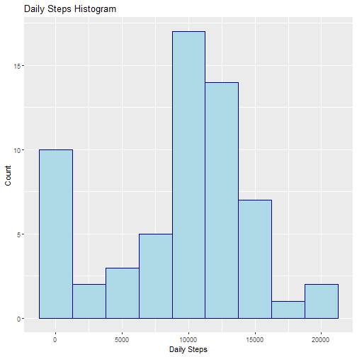
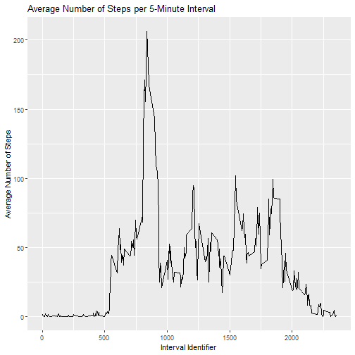
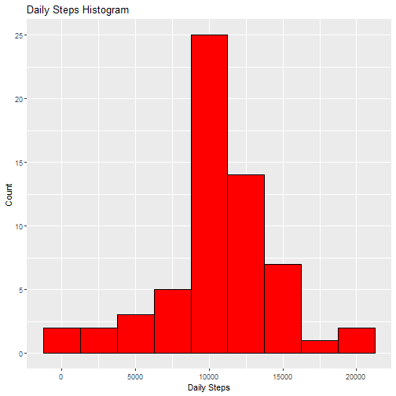

## Introduction

It is now possible to collect a large amount of data about personal movement using activity monitoring devices such as a Fitbit, Nike Fuelband, or Jawbone Up. These type of devices are part of the “quantified self” movement – a group of enthusiasts who take measurements about themselves regularly to improve their health, to find patterns in their behavior, or because they are tech geeks. But these data remain under-utilized both because the raw data are hard to obtain and there is a lack of statistical methods and software for processing and interpreting the data.

This assignment makes use of data from a personal activity monitoring device. This device collects data at 5 minute intervals through out the day. The data consists of two months of data from an anonymous individual collected during the months of October and November, 2012 and include the number of steps taken in 5 minute intervals each day

## Loading and preprocessing the data

Load the necessary libraries to complete the analysis.

```r
library(data.table)
library(ggplot2)
library(knitr)
```
The dataset used in this analysis was downloaded from [here](https://d396qusza40orc.cloudfront.net/repdata%2Fdata%2Factivity.zip) and
saved to a local working drive. First, set the working drive and unzip the data.


```r
setwd("C:/Users/i23764/OneDrive - Verisk Analytics/Documents/R/Reproducible_Research/Week2/RepData_PeerAssessment1")
unzip("activity.zip")
stepdata <- fread(file = "activity.csv", header = TRUE)
```

A summary of the data:

```r
summary(stepdata)
```

```
##      steps             date               interval     
##  Min.   :  0.00   Min.   :2012-10-01   Min.   :   0.0  
##  1st Qu.:  0.00   1st Qu.:2012-10-16   1st Qu.: 588.8  
##  Median :  0.00   Median :2012-10-31   Median :1177.5  
##  Mean   : 37.38   Mean   :2012-10-31   Mean   :1177.5  
##  3rd Qu.: 12.00   3rd Qu.:2012-11-15   3rd Qu.:1766.2  
##  Max.   :806.00   Max.   :2012-11-30   Max.   :2355.0  
##  NA's   :2304
```

## What is mean total number of steps taken per day?

Calculate the total number of steps taken per day.

```r
daily_dt <- stepdata[, sum(steps, na.rm = TRUE), by = date]
setnames(daily_dt, "V1", "steps")
```
Create a histogram of the total number of steps taken each day.

```r
g <- ggplot(daily_dt, aes(x=steps)) +
  geom_histogram(color = "darkblue", fill = "lightblue", binwidth = 2500) +
  ggtitle("Daily Steps Histogram") +
  xlab("Daily Steps") +
  ylab("Count")
g
```



The mean and median total number of steps per day are:

```r
mean <- daily_dt[,mean(steps, na.rm = TRUE)]
median <- as.numeric(daily_dt[,median(steps, na.rm = TRUE)])
```

```
## [1] "The mean daily steps is 9354.22950819672 steps"
```

```
## [1] "The median daily steps is 10395 steps"
```

## What is the average daily activity pattern?
Create a time series plot of the 5-minute interval and average number of steps taken across all days.

```r
avg_daily_dt <- stepdata[, mean(steps, na.rm = TRUE), by = interval]
setnames(avg_daily_dt, "V1", "steps")

t <- ggplot(avg_daily_dt, aes(interval,steps)) +
  geom_line() +
  ggtitle("Average Number of Steps per 5-Minute Interval") +
  xlab("Interval Identifier") +
  ylab("Average Number of Steps")
t
```



Calculate and report the 5-minute interval that contains the maximum number of steps.

```r
max_int <- avg_daily_dt[which.max(avg_daily_dt$steps)][,1]
```

```r
print(paste0("The ",max_int
             ,"th interval contains the greatest number of steps ("
             ,avg_daily_dt[which.max(avg_daily_dt$steps)][,2]," steps)"))
```

```
## [1] "The 835th interval contains the greatest number of steps (206.169811320755 steps)"
```


## Imputing missing values

Note that there are a number of days/intervals where there are missing values. The presence of missing days may introduce bias into some calculations or summaries of the data.

Calculate and report the total number of missing values in the dataset.

```r
NAs <- stepdata[is.na(steps), .N]
print(paste0("The number of missing values is ", NAs))
```

```
## [1] "The number of missing values is 2304"
```

Fill in the missing values using the 5-minute interval averages calculated in Part 3.

```r
stepdata_NArm <- stepdata
for (i in 1:nrow(stepdata)){
  if(is.na(stepdata$steps[i])){
    stepdata_NArm$steps[i] <- avg_daily_dt$steps[stepdata_NArm$interval[i] == 
                                                   avg_daily_dt$interval] 
  }
}

summary(stepdata_NArm)
```

```
##      steps             date               interval     
##  Min.   :  0.00   Min.   :2012-10-01   Min.   :   0.0  
##  1st Qu.:  0.00   1st Qu.:2012-10-16   1st Qu.: 588.8  
##  Median :  0.00   Median :2012-10-31   Median :1177.5  
##  Mean   : 37.38   Mean   :2012-10-31   Mean   :1177.5  
##  3rd Qu.: 27.00   3rd Qu.:2012-11-15   3rd Qu.:1766.2  
##  Max.   :806.00   Max.   :2012-11-30   Max.   :2355.0
```

## Are there differences in activity patterns between weekdays and weekends?

Make a histogram of the total number of steps taken each day.

```r
NArm_daily_dt <- stepdata_NArm[, sum(steps, na.rm = TRUE), by = date]
setnames(NArm_daily_dt, "V1", "steps")

g2 <- ggplot(NArm_daily_dt, aes(x=steps)) +
  geom_histogram(color = "black", fill = "red", binwidth = 2500) +
  ggtitle("Daily Steps Histogram") +
  xlab("Daily Steps") +
  ylab("Count")
g2
```



Calculate and report mean and median total number of steps taken per day after NAs have been updated.

```r
mean_NArm <- NArm_daily_dt[,mean(steps, na.rm = TRUE)]
median_NArm <- as.numeric(NArm_daily_dt[,median(steps, na.rm = TRUE)])
```

```
## [1] "Removing NA values from the dataset changed the mean number of daily steps from 9354.22950819672 to 10766.1886792453 steps."
```

```
## [1] "Removing NA values from the dataset changed the median number of daily steps from 10395 to 10766.1886792453 steps."
```
